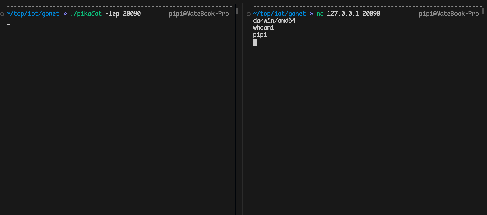

# pikaCat

一个用golang实现的类似nc的工具，起初是想搞一个通用性的iot后渗透工具。大概实现了tcp的文件读写，tcp/udp的连接和监听，正反向命令执行，socks5代理。后续根据需求应该会添加固件提取之类的其他功能。使用了upx尽量压缩编译后的文件大小，但是golang的大小还是比netcat大得多。如果使用过程执行失败可以自己尝试编译一下。


## Use:

### 参数默认值:

host: 0.0.0.0

port: 20090

username: pikaq

password: pikap

### 功能参数

-l 监听

-v 打印详细信息

-e 命令执行

-s socks5代理

### tcp连接

```bash
./pikaCat -t -h 127.0.0.1 -p 20090
or
./pikaCat -h 127.0.0.1 -p 20090 
```


### udp连接

```bash
./pikaCat -u -h 127.0.0.1 -p 20090
```


### tcp-server

```bash
./pikaCat -lp 20090
```


### udp-server

```bash
./pikaCat -lup 20090 
```


### 正向命令执行

```bash
./pikaCat -lep 20090  
```



### 反向命令执行

```bash
./pikaCat -e -h 127.0.0.1 -p 20090
```


### socks代理

默认用户名密码为：pikaq/pikap （我爱皮卡丘）

```bash
./pikaCat -s --user admin --pass admin -h 127.0.0.1 -p 20090
```


### 文件传输

跟netcat用法一样来着，就不赘述了。

---

最后，阿里的编程AI真好用。


